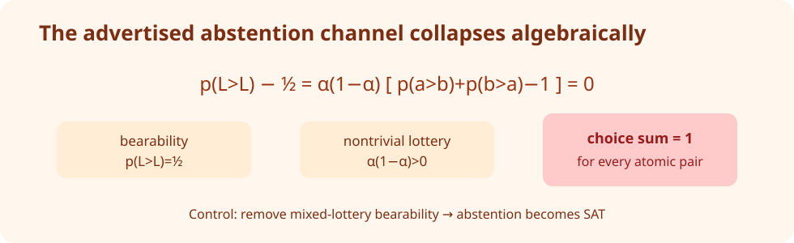

# DPO Unchained: four exact resolutions and one honest boundary


The paper asks how much of Direct Preference Optimization is really logistic-specific. Its answer is an elegant three-part decomposition: proper losses generate regularizers, choice theory generates links, and canonical proper-loss identities recover the DPO objective. We reconstructed the five judged statements at their published quantifier scope. Two claims are verified, two advertised universal statements are falsified, and the central representation theorem remains blocked after four different routes.

| Claim | Paper statement | Observed evidence | Assessment |
| --- | --- | --- | --- |
| 1 | Every increasing `psi,F` admits a real-valued strictly proper composite loss. | `psi(z)=z`, `F=sigmoid` yields an endpoint contradiction. | **FALSIFIED** |
| 2 | Every proper-loss regret is its Bayes-risk Bregman divergence. | Symbolic residual `0`; 200 exact rational checks in dimensions 2–9. | **VERIFIED** |
| 3 | KLST* generalizes choice while permitting abstention. | Its own axioms force choice sums to equal one for every atomic pair. | **FALSIFIED** |
| 4 | Every KLST* probability has an increasing utility-difference link. | Published proof has a domain gap; exhaustive and adversarial searches found no valid counterexample. | **BLOCKED** |
| 5 | The proper-loss triptych contains logistic DPO. | General symbolic residuals `0`; full-domain log-loss identities exact. | **VERIFIED** |

## What was implemented

The fixed entrypoint [`reproduction/run.py`](../../reproduction/run.py) executes every accepted certificate cumulatively. Claims 1 and 3 use symbolic algebra plus independent SMT satisfiability checks in [`reproduction/falsification.py`](../../reproduction/falsification.py). Claims 2 and 5 use an independently reconstructed Savage/Bregman derivation, exact fractions, and mutation controls in [`reproduction/proof_certificates.py`](../../reproduction/proof_certificates.py). Claim 4 adds a complete finite-grid enumerator, a typed premise audit, and an adversarial four-alternative search with two independently implemented monotonicity checkers.

The environment is Python 3.12, locked by `uv.lock`. Every node ran exactly:

```bash
uv sync --frozen && uv run --frozen python -m reproduction.run
```

All research compute used Hugging Face `cpu-upgrade`; jobs reported 64 allocated CPUs and no GPU request. The code deliberately keeps theorem logic in small functions, so each mutation changes a single mathematical premise.

## Claim 1: endpoint properness breaks the universal construction


The theorem's quantifiers let us choose the identity for `psi` and the sigmoid for `F`. If losses are finite real-valued functions on the closed simplex, the claimed composition makes `ell_0` unbounded below as reports approach zero from the interior, while properness at the zero endpoint requires its finite endpoint value to be a global minimum. Choosing `z=ell_0(0)-1` is a direct contradiction. This witness satisfies both monotonicity assumptions and contradicts the exact all-`z` conclusion; it is not a numerical failure or a boundary approximation.

The independent checker asks Z3 whether `c <= c-1`; it returns `UNSAT`. Reversing the properness inequality returns `SAT`. A Brier composite provides a non-vacuous positive control, with regret exactly `(q-p)^2`.

## Claim 2 and Claim 5: the algebra survives


For Claim 2, substitute `phi(p)=-p·ell(p)` and the proper-loss subgradient selection `G(q)=-ell(q)` into the Bregman definition. Expansion is identically the regret `p·ell(q)-p·ell(p)`. A separately coded quadratic scoring rule confirms the identity in 200 exact rational trials across dimensions 2–9; the wrong-sign subgradient produces residual `4` on its witness.

For Claim 5, properness rearranges into the subgradient inequality for `H=ell_0-ell_1`, and Fenchel equality gives `phi*(H(p))=ell_0(p)`. Substituting `x=exp(z)>0` into log loss yields the logistic DPO loss exactly. Nineteen asymmetric strictly proper losses preserve the general identity while rejecting the extra symmetry identity, preventing the checker from smuggling symmetry into the general theorem.

## Claim 3: the abstention mechanism collapses



For a mixed lottery `L=(ab)_alpha`, expandability writes `p(L>L)` as four atomic terms. Atomic and lottery bearability set both sides to one half, leaving `alpha(1-alpha)(S-1)=0`, where `S=p(a>b)+p(b>a)`. Since `alpha` is nontrivial, `S=1` for every pair. Thus the formal KLST* definition is consistent but does not permit the advertised abstention on its atomic domain. Dropping mixed-lottery bearability makes an abstaining model satisfiable, which is the intended negative control.

## Claim 4: four routes stop short of proof or falsification


The first route finds a valid counterexample to a pointwise lemma used in the proof, but not to the theorem antecedent. The second exhausts all 125 reciprocal three-alternative models on a five-point grid and every `9^6` monotonicity sextuple per model: 19 models pass, and all 19 admit a utility-difference order representation. The third route reconstructs the classical representation reduction and finds a typing gap: expandability constructs a mixed lottery in `Y^alpha`, while the external theorem premise is asserted on atomic `Y`; only degenerate lotteries are identified with atoms.

Because confidence remained low, the mandatory fourth route generated 6,000 deterministic four-alternative denominator-20 models. SMT rejected 5,987 as nonrepresentable, then exact monotonicity rejected every candidate. A linear positive control passes both the vectorized and brute-force implementations; a cyclic negative control is rejected with a concrete sextuple. These searches are substantial but finite. They cannot establish a universal theorem, and no assumption-satisfying counterexample emerged, so Claim 4 is **BLOCKED**.

## Compute and provenance

The baseline job took 16 seconds; constructive, falsification, and the two early Claim 4 jobs each took about 21 seconds; the adversarial job took 42 seconds, with 20.912 seconds inside the verifier. Core estimates ranged from 2 to 8, while `cpu-upgrade` allocated 64 CPUs. No GPU was requested. The formal evidence is rooted at scientific commit `be9e71d16855a80ab75cf19b6aedd0f009ac97d5`; individual earlier commits and run IDs are recorded in `space_candidate/artifacts/runs.json`.

## Assessment

The previous live judge score is still **5/10**. The conservative projected range is **8–9/10**, and the best-supported possible score is **9/10**—both forecasts, not earned points. Claims 1, 2, 3, and 5 now have direct proof-level or valid falsification evidence with controls. Claim 4 is releaseable only as a rigorously documented `BLOCKED` claim. A formal reconstruction closing the atomic/mixed-lottery domain step, or a valid KLST* counterexample, would be needed to resolve it.

Relevant lineage: [constructive certificates](https://github.com/MachineLearning-Nerd/icml26-dpo-unchained-human-choice-theory/tree/audit/constructive-certificates), [exact falsifications](https://github.com/MachineLearning-Nerd/icml26-dpo-unchained-human-choice-theory/tree/audit/claims-1-3-falsification), [finite Claim 4 search](https://github.com/MachineLearning-Nerd/icml26-dpo-unchained-human-choice-theory/tree/audit/claim-4-finite-klst-search), [reduction audit](https://github.com/MachineLearning-Nerd/icml26-dpo-unchained-human-choice-theory/tree/audit/claim-4-representation-reduction), and [mandatory adversarial route](https://github.com/MachineLearning-Nerd/icml26-dpo-unchained-human-choice-theory/tree/audit/claim-4-adversarial-falsification).
