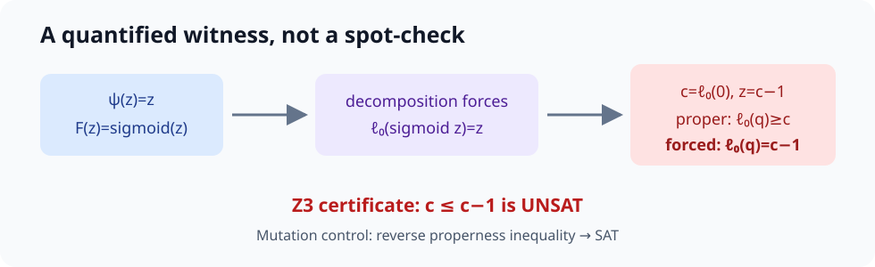

# Claim 1 — FALSIFIED



## Exact contract and assumptions

Theorem 4.3, v4 anchors `content/generalization.tex:66–71` and `content/appendix-proofs.tex:125–170`: **for every** strictly increasing `psi:R→R` and **every** strictly increasing `F:R→[0,1]`, there exists a strictly proper binary **real-valued** loss `(ell0,ell1)` with `psi(z)=ell0(F(z))` **for all** real `z`. Definition 3.1 supplies the closed simplex and real-valued loss codomain. [Machine-readable contract](../../artifacts/claim_contract.json); [source audit](../../artifacts/source_audit.md).

The witness `psi(z)=z`, `F(z)=sigmoid(z)` satisfies both increasing-function assumptions. No differentiability, convexity, boundedness, or surjectivity assumption is added.

## Executable verifier and raw result

Current source: [`falsification.py`](../../reproduction/falsification.py), called by [`run.py`](../../reproduction/run.py). Fixed command:

```bash
uv sync --frozen && uv run --frozen python -m reproduction.run
```

Let `c=ell0(0)`, finite because the loss is real-valued. Properness at true probability zero requires `ell0(q)≥c` for every report. Decomposition at `z=c−1` instead gives `q=sigmoid(c−1)∈(0,1)` and `ell0(q)=c−1<c`. The Z3 system is **UNSAT**. Five 60-digit Decimal witnesses independently confirm the interior-report and strict-inequality obligations. [Raw JSON](../../artifacts/results.json).

## Independent checker and controls

- Independent checker: Z3 proves the core properness/decomposition inequalities inconsistent; Decimal arithmetic checks five endpoint values.
- Negative control: reverse the properness inequality; the mutant is **SAT**.
- Positive control: the Brier composite `psi(z)=sigmoid(z)^2`, `ell0(q)=q^2` has exact regret `(q−p)^2`, residual `0`.

## Provenance, verdict, and limitation

Scientific SHA `3ada4e95a82907b7f350bc66088d6394c1e4cdef`; seed-free; estimated 2 cores, actual 64 CPUs; HF job 21 s, verifier 0.308565 s; no GPU. **Reviewer verdict: FALSIFIED, confidence HIGH.** The falsification depends on the paper's explicit finite real-valued endpoint loss definition. Allowing extended-real endpoint loss values would evade this witness but would change the stated codomain.
