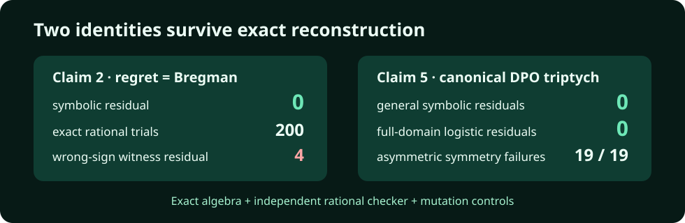

# Claim 5 — VERIFIED

## Exact contract and assumptions

Theorem 4.4 and Corollary 4.5, v4 anchors `content/generalization.tex:96–117` and `content/appendix-proofs.tex:173–212`: for every strictly proper binary loss, `H=ell0−ell1` is a subgradient of `phi=−L(p,p)` and `phi*(H(p))=ell0(p)`; symmetry supplies the companion identity, and log loss/sigmoid yields standard logistic DPO over the full canonical-link domain. [Contract](../../artifacts/claim_contract.json); [source audit](../../artifacts/source_audit.md).

The general identity is kept separate from the additional symmetry assumption. The DPO specialization substitutes `x=exp(z)>0`, so it covers every real `z` without finite sampling.

## Executable verifier and raw result

Current source: [`proof_certificates.py`](../../reproduction/proof_certificates.py), called by [`run.py`](../../reproduction/run.py). Fixed command: `uv sync --frozen && uv run --frozen python -m reproduction.run`.

The general subgradient residual and Fenchel residual are both **0**. The exact log-loss identities `H(sigmoid(z))−z`, `ell0−log(1+exp(z))`, and `ell1−log(1+exp(−z))` are all **0** after the positive substitution. [Raw JSON](../../artifacts/results.json).

## Independent checker and controls

- Nineteen exact-Fraction asymmetric Brier-plus-constant losses preserve the general canonical identity and reject the symmetry identity in all 19 cases.
- Negative control: reverse `H=ell0−ell1`; the witness residual is **2**.
- Fail-closed behavior: any nonzero symbolic residual, missing asymmetric failure, or undetected sign mutation raises `AssertionError`.

## Provenance, verdict, and limitation

Scientific SHA `eb77763fe9669bf02fcece1b6fb93b8cab4b8b67`; deterministic; estimated 4 cores, actual 64 CPUs; HF job 21 s, verifier 0.336413 s; no GPU. **Reviewer verdict: VERIFIED, confidence HIGH.** This establishes the proper-loss canonical identities and DPO specialization, not an empirical claim that every possible preference-training run behaves identically.
