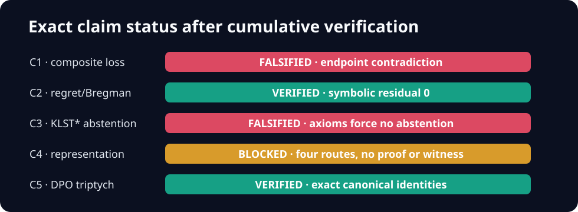

# Current verification — supersedes the toy baseline

**Current cumulative verifier:** [`reproduction/run.py`](../reproduction/run.py) at scientific revision `be9e71d16855a80ab75cf19b6aedd0f009ac97d5`, executed by the fixed command `uv sync --frozen && uv run --frozen python -m reproduction.run` on Hugging Face `cpu-upgrade`. The [fail-closed release audit](../reproduction/release_audit.py) is part of that same entrypoint. It exits nonzero if a scientific certificate, control, raw-data match, visibility link, historical hash, notebook, SVG, or secret scan fails.

| Claim | Exact source contract | Current verdict | Decisive evidence |
| --- | --- | --- | --- |
| [1](claim-1/page.md) | For all increasing `psi,F`, a finite real-valued strict proper composite loss exists. | **FALSIFIED** | Identity/sigmoid endpoint contradiction; SMT `UNSAT`. |
| [2](claim-2/page.md) | Every proper-loss regret equals the stated Bregman divergence. | **VERIFIED** | Dimension-free symbolic residual `0`; 200 exact checks. |
| [3](claim-3/page.md) | KLST* permits abstention while satisfying its stated axioms. | **FALSIFIED** | Axioms force every atomic choice sum to `1`. |
| [4](claim-4/page.md) | Every KLST* probability has an increasing utility-difference link. | **BLOCKED** | Proof-domain gap; four routes find no valid counterexample or proof. |
| [5](claim-5/page.md) | Proper-loss canonical identities recover logistic DPO. | **VERIFIED** | Exact general and full-domain specialization residuals `0`. |

The previous live judged score remains **5/10**. The conservative post-publication forecast is **8–9/10** and the best-supported possible score is **9/10**; neither is a judge result.

## Direct evidence map

- [Exact contracts and source hashes](../artifacts/claim_contract.json)
- [Full source audit](../artifacts/source_audit.md)
- [Raw machine-readable results](../artifacts/results.json)
- [Run IDs, SHAs, core estimates, actual CPUs, and runtimes](../artifacts/runs.json)
- [Pinned environment](../pyproject.toml) and [uv lockfile](../uv.lock)
- [Method and provenance](methodology/page.md)
- [Complete visibility matrix](visibility/page.md)
- [Forecast and release report](release-report/page.md)
- [Evaluator-blind review](red-team/page.md)
- [Historical rejected baseline](historical/page.md)

The historical numerical spot-check is preserved but no longer appears as “Verification run.” The code and revision above explicitly supersede it.
